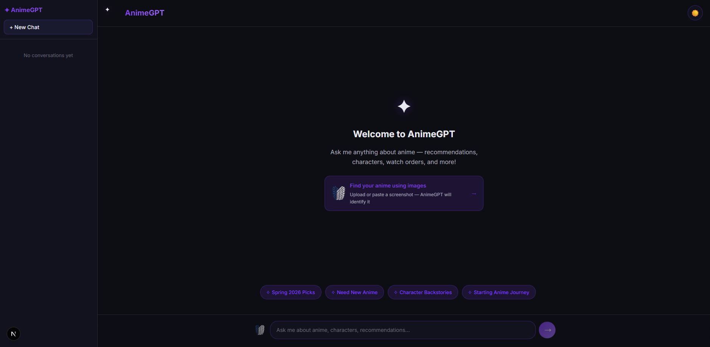
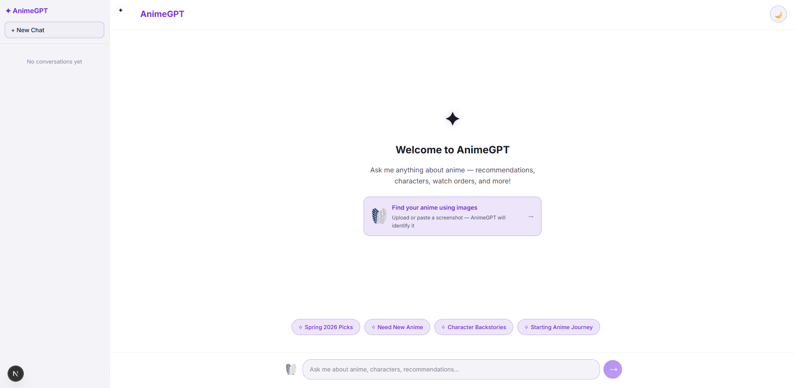
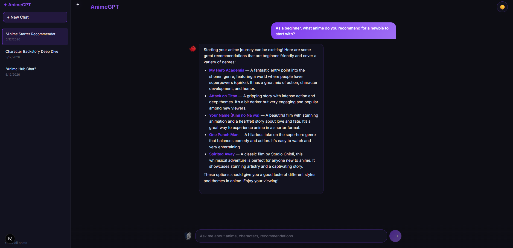
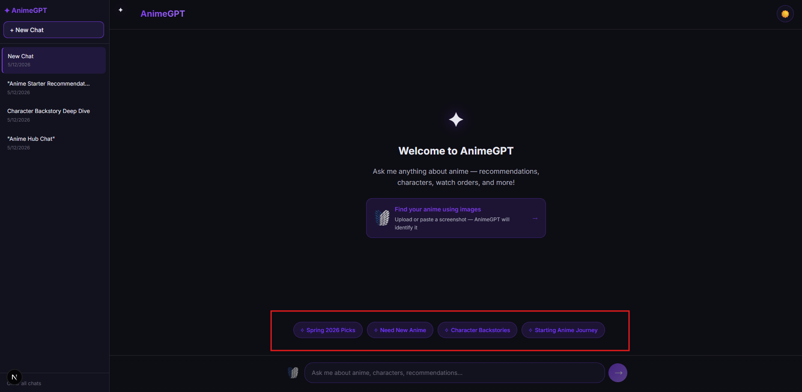
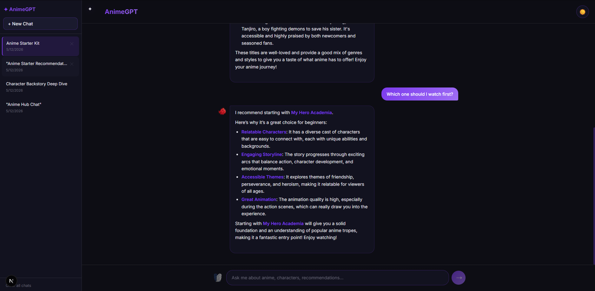
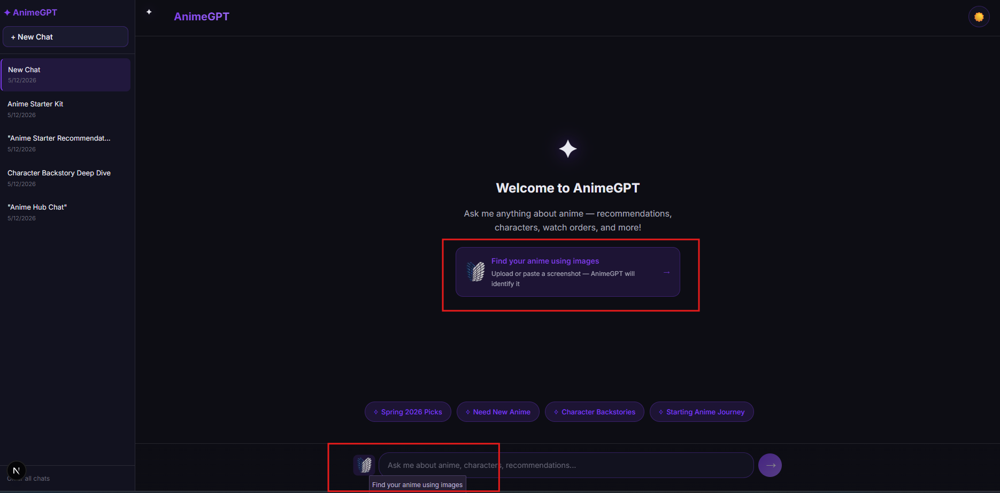
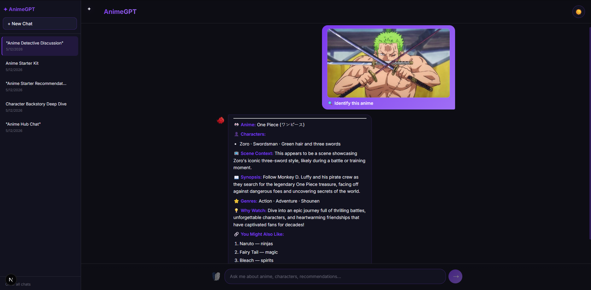
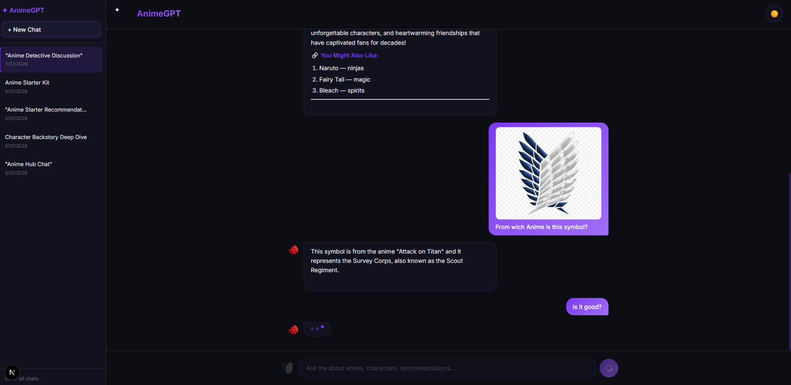
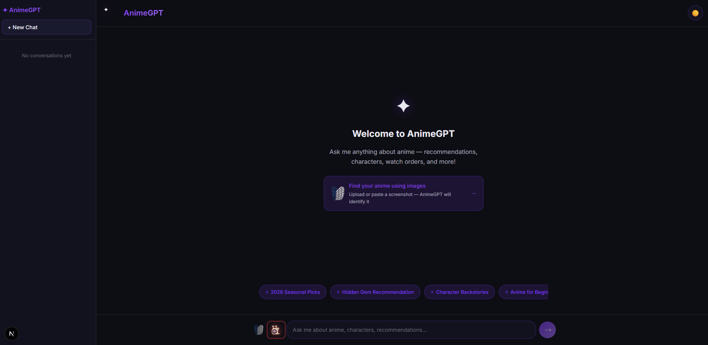

# AnimeGPT

AnimeGPT is a personal AI chatbot project built for anime fans. It lets users ask questions about anime, get recommendations, explore characters, understand storylines, check watch orders, and receive friendly anime-focused answers through a modern chat interface.

The project was built to practice modern full-stack AI development using **Next.js**, **OpenAI**, **Astra DB**, **LangChain.js**, and a **Retrieval-Augmented Generation (RAG)** workflow — extended with GPT-4o vision support, voice input via OpenAI Whisper, conversation history, dark/light theming, image-based anime identification, and Google OAuth authentication with a freemium access model.

---

## Author

Created by **Montassar Laboudi**.

---

## Demo

### Home Screen — Dark Mode

The app opens with a clean dark interface, a custom AnimeGPT logo, and four dynamic prompt suggestions generated fresh by GPT.



---

### Home Screen — Light Mode

A single toggle switches the entire interface to light mode. The theme is saved across sessions.



---

### Conversation Sidebar

The sidebar lists all saved conversations sorted by most recent. Each conversation can be renamed, resumed, or deleted independently.



---

### Anime Recommendation

A user asks for anime recommendations. AnimeGPT responds with a formatted, markdown-styled list including reasons for each pick.



---

### Follow-up Question

The conversation continues naturally. AnimeGPT keeps context across messages and gives a focused follow-up answer.



---

### Image Upload Preview

The user attaches an image using the upload button. The image appears in the preview bar above the input before sending.



---

### Anime Image Identification

Using the "Find your anime using images" feature card, the user selects an image. AnimeGPT automatically identifies the anime, characters, scene context, synopsis, genres, and similar recommendations.



---

### Paste Image via Ctrl+V

The user pastes an image directly into the chat input using Ctrl+V. The image appears in the preview bar, ready to send.


---

### Typing Indicator

While AnimeGPT is generating a response, an animated typing bubble with three bouncing dots is shown.



---

### Voice Input — Den Den Mushi *(New Feature)*

> **This feature was added after the original screenshots were taken and is not visible in any of the earlier demo images.**

The Den Den Mushi button sits between the image upload button and the text input. One click starts recording your voice. A red glowing ring pulses around the snail while it is listening. Click again to stop — AnimeGPT transcribes the audio using OpenAI Whisper and pastes the result directly into the input field. You can review, edit, and send the text as usual.

The **Den Den Mushi** (デン デン ムシ) is the iconic snail-shaped communication device from *One Piece* — used throughout the series as a telephone and video phone by pirates, marines, and everyone in between. It was chosen as the button icon here as a deliberate anime reference: a creature literally made for transmitting voice, used as the gateway for voice input in an anime chatbot.



---

## Overview

AnimeGPT is more than a basic chatbot. It uses a **Retrieval-Augmented Generation (RAG)** system to improve answer quality with anime-related data stored in a vector database.

Instead of relying only on the AI model's general knowledge, the app retrieves relevant anime content from a custom knowledge base and sends that context to OpenAI before generating a response.

The app also supports **GPT-4o vision**: users can upload or paste an anime screenshot and AnimeGPT will identify the anime, characters, and scene in a structured response.

All conversations are saved locally in the browser and can be resumed or managed from the sidebar.

Guest users get **5 free questions** before being prompted to sign in. Signing in with Google unlocks unlimited access and resets the counter.

---

## Features

- Anime recommendations, character explanations, story summaries, watch orders
- Episode and filler guidance, genre explanations, manga comparisons
- Anime news and trend-based answers for 2026
- Dynamic prompt suggestions generated by GPT on each session
- Conversation history with sidebar — create, switch, rename, delete conversations
- Conversations sorted by most recent activity
- Per-conversation message isolation — each chat stores its own history independently
- Streaming chatbot responses with animated typing indicator
- Dark and light mode with persistent theme preference
- Image upload via button or Ctrl+V paste
- "Find your anime using images" feature — auto-identifies anime from screenshots
- Structured 7-section identification response (anime, characters, scene, synopsis, genres, why watch, similar picks)
- Images displayed inline in chat bubbles
- **Voice input via Den Den Mushi button** — records audio, transcribes via OpenAI Whisper, pastes text into the input *(new)*
- Animated recording indicator: red glow + pulsing ring around the Den Den Mushi icon while recording *(new)*
- Accent-colored spinner overlay on the icon during transcription processing *(new)*
- **Freemium access model** — 5 free questions for guests, sign-in required after that *(new)*
- Warning banner appears at 3 remaining questions to encourage sign-in *(new)*
- **Google OAuth sign-in** via NextAuth v5 — one click, no password *(new)*
- **User menu** in the header — avatar, display name, dropdown with Profile / Sign out / Delete account *(new)*
- **Profile editing** — override Google display name and photo, stored in localStorage *(new)*
- Two-step confirmation for account deletion *(new)*
- Copy button on assistant messages
- Auto-growing textarea input (up to 140px)
- Mobile-friendly sidebar with backdrop overlay
- RAG-powered anime knowledge retrieval from Astra DB
- Custom AnimeGPT logo and branding

---

## Tech Stack

| Technology | Role |
|---|---|
| **Next.js 15** | Full-stack React framework (App Router) |
| **React 19** | UI components and client-side interactivity |
| **TypeScript** | Type-safe JavaScript throughout |
| **OpenAI GPT-4o** | Vision-based anime image identification |
| **OpenAI GPT-4o mini** | Text chat responses via RAG |
| **OpenAI text-embedding-3-small** | Embedding generation for vector search |
| **OpenAI Whisper** | Speech-to-text transcription for voice input |
| **Vercel AI SDK v3** | Streaming AI chat responses (`useChat`, `OpenAIStream`) |
| **NextAuth v5** | Google OAuth authentication with JWT sessions |
| **Astra DB** | Vector database for storing and retrieving anime embeddings |
| **LangChain.js** | Text splitting and document processing |
| **Puppeteer** | Scraping anime-related website content |
| **ReactMarkdown** | Rendering markdown-formatted AI responses |
| **CSS custom properties** | Dark/light theming with `--accent-primary` purple palette |

---

## Project Structure

```txt
nextjs-animegpt/
├── app/
│   ├── api/
│   │   ├── auth/
│   │   │   └── [...nextauth]/
│   │   │       └── route.ts           ← NextAuth v5 catch-all handler
│   │   ├── chat/
│   │   │   └── route.ts               ← Main chat API (RAG + GPT-4o vision)
│   │   ├── generate-title/
│   │   │   └── route.ts               ← Generates conversation titles
│   │   ├── suggestions/
│   │   │   └── route.ts               ← Generates dynamic prompt suggestions
│   │   └── transcribe/
│   │       └── route.ts               ← Voice transcription API (OpenAI Whisper)
│   │
│   ├── assets/
│   │   ├── AG-Logo.png                ← AnimeGPT logo (header + assistant bubble)
│   │   ├── Animegpt-Logo.svg          ← SVG logo variant
│   │   ├── Camera.png                 ← Image upload button icon
│   │   └── DenDenMochi.png            ← Voice input button icon (Den Den Mushi from One Piece)
│   │
│   ├── components/
│   │   ├── AuthSessionProvider.tsx    ← 'use client' wrapper for NextAuth SessionProvider
│   │   ├── Bubble.tsx                 ← Chat message bubble (user + assistant)
│   │   ├── LoadingBubble.tsx          ← Animated typing indicator
│   │   ├── ProfileModal.tsx           ← Edit display name and photo *(new)*
│   │   ├── PromptSuggestionButton.tsx
│   │   ├── PromptSuggestionsRow.tsx
│   │   ├── Sidebar.tsx                ← Conversation sidebar
│   │   ├── SignInModal.tsx            ← Full-screen overlay shown when free limit is reached *(new)*
│   │   ├── UsageBanner.tsx            ← Warning strip shown at 3 remaining questions *(new)*
│   │   └── UserMenu.tsx              ← Header avatar + dropdown (Profile / Sign out / Delete) *(new)*
│   │
│   ├── global.css                     ← All styles with dark/light CSS variables
│   ├── icon.png                       ← Browser tab favicon (Den Den Mushi)
│   ├── layout.tsx
│   └── page.tsx                       ← Main chat page with all state and logic
│
├── lib/
│   ├── useConversations.ts            ← Conversation persistence hook (localStorage)
│   ├── useProfile.ts                  ← Display name / photo overrides hook (localStorage) *(new)*
│   └── useUsageCounter.ts             ← Guest usage counter + freemium gate hook *(new)*
│
├── auth.ts                            ← NextAuth v5 config (Google provider) *(new)*
├── middleware.ts                      ← NextAuth session middleware *(new)*
│
├── scripts/
│   └── loadDb.ts                      ← Scrape + embed + seed Astra DB
│
├── test/
│   ├── screenshot-01-home-dark.png
│   ├── screenshot-02-home-light.png
│   ├── screenshot-03-sidebar-open.png
│   ├── screenshot-04-chat-recommendation.png
│   ├── screenshot-05-follow-up.png
│   ├── screenshot-06-image-preview-bar.png
│   ├── screenshot-07-identify-response.png
│   ├── screenshot-08-paste-image.png
│   ├── screenshot-09-typing-bubble.png
│   └── screenshot-10-transcribe_audio.png
│
├── .env
├── .gitignore
├── auth.ts
├── eslint.config.mjs
├── LICENSE
├── middleware.ts
├── next-env.d.ts
├── next.config.ts
├── package.json
├── README.md
└── tsconfig.json
```

---

## How It Works

AnimeGPT uses a **Retrieval-Augmented Generation** workflow for text questions and **GPT-4o vision** for image questions.

### 1. Data Collection

The project uses a seed script to collect anime-related text from selected websites.

```txt
scripts/loadDb.ts
```

It uses Puppeteer to open pages, extract text, and prepare the content for processing.

---

### 2. Text Splitting

Large blocks of scraped text are split into smaller chunks using LangChain.js. This makes the content easier to embed, store, and retrieve.

---

### 3. Embedding Generation

Each text chunk is converted into a vector embedding using OpenAI's `text-embedding-3-small` model. Embeddings are numerical representations of text that allow the database to search by meaning instead of exact word matching.

---

### 4. Vector Storage

The generated embeddings are stored in Astra DB. Each record contains the text chunk, its vector, and an optional source URL.

---

### 5. User Question

When a user asks a text question, the API route embeds the message and searches Astra DB for the most similar anime content. The retrieved context is included in the system prompt sent to `gpt-4o-mini`.

When a user uploads or pastes an image, the API route sends it directly to `gpt-4o` as a base64-encoded image with a structured identification prompt. RAG is bypassed for image queries.

---

### 6. Response Streaming

The OpenAI response is streamed back to the browser token by token. A typing indicator is shown while the response is in flight.

---

## Chat Flow

```txt
User sends a text message
        ↓
Next.js API route receives request
        ↓
OpenAI creates an embedding for the question
        ↓
Astra DB finds the most similar anime content
        ↓
Relevant context is added to the system prompt
        ↓
gpt-4o-mini generates a streamed response
        ↓
Response streams into the chat bubble
```

```txt
User uploads or pastes an image
        ↓
Image is base64-encoded in the browser
        ↓
Next.js API route receives image + hidden prompt
        ↓
gpt-4o identifies the anime, characters, and scene
        ↓
Structured response streams into the chat bubble
```

---

## Freemium Access Model *(New)*

Guest users (not signed in) can send **5 free questions** before they are asked to sign in.

### How it works

- A counter is stored in `localStorage` under `animegpt-usage-count`
- The counter increments on every message sent while logged out
- At **3 remaining questions** a warning banner appears above the input bar prompting the user to sign in
- When the limit is reached a full-screen sign-in modal blocks further input
- Signing in with Google resets the counter and grants unlimited access
- Signing out resets the gate — the guest counter starts from zero again

### Why sign in?

Google sign-in is frictionless (one click, no password) and allows the app to identify returning users. It is the only sign-in method supported.

```txt
Guest sends message
        ↓
Usage counter increments in localStorage
        ↓
count >= 3 → warning banner appears
        ↓
count >= 5 → sign-in modal appears, input is blocked
        ↓
User clicks "Continue with Google"
        ↓
NextAuth completes Google OAuth flow
        ↓
Counter is reset, unlimited access granted
```

---

## Authentication *(New)*

Authentication is handled by **NextAuth v5** with the Google provider.

### Setup

1. Create a project at [console.cloud.google.com](https://console.cloud.google.com)
2. Enable the Google OAuth API and create credentials
3. Set the authorised redirect URI to:
   ```
   http://localhost:3000/api/auth/callback/google
   ```
4. Add your credentials to `.env`:
   ```env
   AUTH_GOOGLE_ID=your_google_client_id
   AUTH_GOOGLE_SECRET=your_google_client_secret
   AUTH_SECRET=your_random_secret_string
   ```

### Files

| File | Role |
|---|---|
| `auth.ts` | NextAuth v5 configuration — Google provider, JWT sessions |
| `middleware.ts` | Session middleware applied to all routes |
| `app/api/auth/[...nextauth]/route.ts` | Catch-all route exporting NextAuth GET/POST handlers |
| `app/components/AuthSessionProvider.tsx` | `'use client'` wrapper so `SessionProvider` can live in a Server Component layout |

---

## User Menu & Profile *(New)*

When signed in, the header shows the user's avatar, first name, and a dropdown menu.

### Dropdown options

| Option | Action |
|---|---|
| **Profile** | Opens the profile editor modal |
| **Sign out** | Signs out and redirects to home |
| **Delete account** | Two-step confirmation → clears localStorage and signs out |

### Profile editor

Clicking **Profile** opens a modal where the user can:

- **Edit display name** — the Google account name is the default; any change is stored in `localStorage`
- **Change profile photo** — click the avatar to open a file picker; the chosen image is resized to 256×256 JPEG using the Canvas API before being stored as a base64 string in `localStorage`

Overrides are applied everywhere the name or photo appears (header trigger, dropdown card) without touching the underlying Google session.

Profile overrides are stored under `animegpt-profile` in `localStorage` and persist across sessions until the user deletes their account.

---

## Image Identification Feature

The "Find your anime using images" feature card lets users identify any anime from a screenshot.

**How to use it:**

1. Click the feature card on the home screen
2. Select an image file (or paste an image with Ctrl+V into the input)
3. AnimeGPT submits the image automatically
4. A structured response appears covering:
   - Anime name
   - Visible characters
   - Scene context
   - Spoiler-free synopsis
   - Genres and themes
   - Why you should watch it
   - Similar anime you might like

The prompt shown in the chat is a friendly `🔍 Identify this anime` display text. The actual detailed identification prompt is sent silently to the API without being shown to the user.

---

## Voice Input Feature — Den Den Mushi *(New)*

The Den Den Mushi button enables hands-free voice input powered by OpenAI Whisper.

### About the Den Den Mushi

The **Den Den Mushi** (デン デン ムシ, literally "electric snail") is the telephone of the *One Piece* universe. These snails can transmit voice and video and are used by everyone from pirates to the World Government. Choosing the Den Den Mushi as the voice input icon is an anime-native reference: the creature is literally built to carry your voice.

### How to use it

1. Click the Den Den Mushi icon in the input bar (between the image button and the text field)
2. The browser asks for microphone permission on first use — allow it
3. The icon's red glowing ring starts pulsing to show recording is active
4. Speak your question or message
5. Click the icon again to stop recording
6. The icon dims with a spinner while your audio is sent to OpenAI Whisper
7. The transcribed text is pasted into the input field — review it, edit if needed, and send

Whisper automatically detects the spoken language and transcribes in the original language — no forced English translation.

### How it works

```txt
User clicks Den Den Mushi button
        ↓
Browser MediaRecorder captures microphone audio (WebM format)
        ↓
User clicks again to stop — audio blob is assembled
        ↓
Audio is POSTed to /api/transcribe as multipart/form-data
        ↓
OpenAI Whisper (whisper-1) transcribes in the detected language
        ↓
Transcribed text is appended to the textarea content
        ↓
User reviews, edits if needed, and sends normally
```

### Visual states

| State | What you see |
|-------|-------------|
| Idle | Den Den Mushi at normal opacity |
| Hover | Slight scale-up with accent background |
| Recording | Red drop-shadow glow + pulsing red ring border |
| Transcribing | Dimmed/greyscale icon + accent-purple spinner ring |

---

## Conversation Sidebar

All conversations are stored in the browser's `localStorage` and managed by the `useConversations` hook in `lib/useConversations.ts`.

**Sidebar features:**

- New Chat button creates a fresh conversation
- Each conversation shows its auto-generated title and last active time
- Conversations are sorted by most recent activity
- Switching conversations loads that conversation's exact messages
- Deleting a conversation removes it from the list and storage
- Clear All removes every conversation at once

Conversation titles are generated automatically by GPT after the first assistant response. If a title already exists it is never overwritten.

---

## Example Use Cases

```txt
What are the best anime for beginners?
```

```txt
Recommend me an anime like Solo Leveling
```

```txt
Give me a spoiler-free explanation of One Piece
```

```txt
What should I watch after Demon Slayer?
```

```txt
[upload a screenshot] → AnimeGPT identifies the anime and characters
```

```txt
[click Den Den Mushi, speak] → AnimeGPT transcribes and fills the input
```

---

## Environment Variables

Create a `.env` file in the project root:

```env
ASTRA_DB_NAMESPACE=your_astra_namespace
ASTRA_DB_COLLECTION=your_collection_name
ASTRA_DB_API_ENDPOINT=your_astra_api_endpoint
ASTRA_DB_APPLICATION_TOKEN=your_astra_application_token
OPENAI_API_KEY=your_openai_api_key
AUTH_GOOGLE_ID=your_google_client_id
AUTH_GOOGLE_SECRET=your_google_client_secret
AUTH_SECRET=your_random_secret_string
```

| Variable | Description |
|---|---|
| `ASTRA_DB_NAMESPACE` | Astra DB namespace / keyspace |
| `ASTRA_DB_COLLECTION` | Collection used to store anime vectors |
| `ASTRA_DB_API_ENDPOINT` | Astra DB API endpoint URL |
| `ASTRA_DB_APPLICATION_TOKEN` | Astra DB authentication token |
| `OPENAI_API_KEY` | OpenAI API key (chat, vision, embeddings, Whisper) |
| `AUTH_GOOGLE_ID` | Google OAuth client ID |
| `AUTH_GOOGLE_SECRET` | Google OAuth client secret |
| `AUTH_SECRET` | Random secret used by NextAuth to sign session tokens |

---

## Git — Commit & Push

Stage all changes, commit, and push to `main` in three commands:

```bash
git add .
git commit -m "your message here"
git push origin main
```

Or as a single one-liner:

```bash
git add . && git commit -m "your message here" && git push origin main
```

If your local branch is behind the remote, pull with rebase first:

```bash
git pull --rebase origin main
git push origin main
```

---

## Installation

Clone the project:

```bash
git clone https://github.com/montassar-laboudi/animegpt-rag-chatbot.git
```

Go into the project folder:

```bash
cd animegpt-rag-chatbot
```

Install dependencies:

```bash
npm install
```

---

## Running the Development Server

```bash
npm run dev
```

Open the app in your browser:

```txt
http://localhost:3000
```

---

## Loading Anime Data

To scrape anime data, create embeddings, and store them in Astra DB:

```bash
npm run seed
```

This runs `scripts/loadDb.ts`, which:

1. Opens anime-related websites using Puppeteer
2. Extracts and cleans page text
3. Splits the text into chunks using LangChain.js
4. Creates OpenAI embeddings for each chunk
5. Saves the chunks and vectors into Astra DB

---

## Main Files

### `app/page.tsx`

The main chatbot page. Handles all chat state, conversation switching, image upload, voice recording, theme toggling, sidebar open/close, freemium gate, and message rendering.

---

### `app/api/chat/route.ts`

The backend API route. Handles both text questions (RAG + gpt-4o-mini) and image questions (GPT-4o vision). Validates environment variables, builds context from Astra DB, and streams the OpenAI response.

---

### `app/api/generate-title/route.ts`

Generates a short conversation title from the first user message using GPT. Called once per conversation after the first assistant response.

---

### `app/api/suggestions/route.ts`

Returns four dynamic anime-related prompt suggestions generated by GPT. Called on each new session to keep the home screen fresh.

---

### `app/api/transcribe/route.ts` *(New)*

The voice transcription API route. Receives a recorded audio file (WebM) uploaded from the browser as multipart/form-data, forwards it to OpenAI Whisper (`whisper-1`) with `verbose_json` response format, and returns the transcribed text as JSON. Using `verbose_json` ensures Whisper outputs in the detected language rather than silently translating to English.

---

### `auth.ts` *(New)*

NextAuth v5 configuration. Exports `handlers`, `signIn`, `signOut`, and `auth`. Configures the Google provider using `AUTH_GOOGLE_ID` and `AUTH_GOOGLE_SECRET`.

---

### `middleware.ts` *(New)*

NextAuth session middleware applied to all routes (excluding static assets). Ensures the session cookie is refreshed on every request.

---

### `lib/useConversations.ts`

Custom React hook managing conversation persistence in `localStorage`. Handles create, read, update, delete, sort, and title-save operations with stale-closure-safe patterns.

---

### `lib/useUsageCounter.ts` *(New)*

Custom React hook tracking guest usage. Reads and writes to `localStorage` under `animegpt-usage-count`. Exposes `isAtLimit` (blocks input at 5) and `showWarning` (triggers banner at 3 remaining). Resets automatically when the user signs in.

---

### `lib/useProfile.ts` *(New)*

Custom React hook for storing display name and photo overrides in `localStorage` under `animegpt-profile`. Returns `displayName` and `displayImage` that fall back to the Google session values when no override is set.

---

### `app/components/AuthSessionProvider.tsx` *(New)*

A `'use client'` wrapper component that renders NextAuth's `SessionProvider`. Required because `app/layout.tsx` is a Server Component and `SessionProvider` is a client-only component.

---

### `app/components/SignInModal.tsx` *(New)*

Full-screen overlay shown when the guest free limit (5 questions) is reached. Displays a "Continue with Google" button that triggers the NextAuth sign-in flow.

---

### `app/components/UsageBanner.tsx` *(New)*

A warning strip rendered above the input bar when a guest user has 3 or fewer questions remaining. Shows the remaining count and an inline sign-in button.

---

### `app/components/UserMenu.tsx` *(New)*

Header component for signed-in users. Shows the user's avatar (Google or custom), first name, and an animated chevron. Clicking opens a dropdown with Profile, Sign out, and Delete account options. Outside-click dismisses the dropdown.

---

### `app/components/ProfileModal.tsx` *(New)*

Modal for editing the user's display name and profile photo. The Google account values are pre-filled as defaults. Photo uploads are resized to 256×256 JPEG using the Canvas API before being stored as base64 in `localStorage`.

---

### `app/components/Sidebar.tsx`

Sidebar component listing all conversations. Supports selecting, deleting, and clearing conversations. Collapses behind a backdrop on mobile.

---

### `app/components/Bubble.tsx`

Renders a single chat message. User bubbles support inline image previews. Assistant bubbles render markdown and include a hover-activated copy button.

---

### `app/components/PromptSuggestionsRow.tsx`

Displays the four dynamic prompt suggestion buttons on the home screen.

---

### `scripts/loadDb.ts`

Database seeding script. Scrapes anime websites, splits and embeds the content, and stores everything in Astra DB.

---

## Styling

All styles are in `app/global.css` using CSS custom properties for theming.

```css
[data-theme="dark"]  { --accent-primary: #7c3aed; --bg-primary: #0d0d14; ... }
[data-theme="light"] { --accent-primary: #6d28d9; --bg-primary: #ffffff; ... }
```

The design includes:

- Dark and light theme with instant toggle
- Custom AnimeGPT logo in header and assistant avatar
- Sidebar with conversation list and delete controls
- Rounded chat bubbles with distinct user and assistant styles
- Inline image display in user bubbles
- Animated typing indicator with three bouncing dots
- Auto-growing textarea input (capped at 140px)
- Image preview bar with remove button
- "Find your anime using images" feature card
- Copy button on assistant messages (revealed on hover)
- Mobile sidebar with full-screen backdrop overlay
- Smooth fade and scale animations on new messages
- Den Den Mushi voice button with three animated states: red glow ring (recording), greyscale + spinner (transcribing)
- User menu dropdown with avatar, name, chevron, and animated open/close
- Profile editor modal with canvas-resized photo upload
- Sign-in modal overlay with blur backdrop
- Usage warning banner with inline sign-in CTA

---

## Notes

- This is a personal project created for learning and experimentation.
- The chatbot is not an official anime database.
- Images uploaded for identification are not stored or persisted — they exist only in the current session.
- Conversation messages and titles are stored in `localStorage` only. Clearing browser data will remove all history.
- The quality of RAG answers depends on the quality of the scraped and embedded data.
- The app is designed to avoid spoilers unless the user clearly asks for them.
- Guest usage count, conversation history, and profile overrides are all stored in `localStorage` — signing out does not clear them unless the user deletes their account.

---

## Troubleshooting

### Missing Environment Variables

If the app throws an environment variable error on startup, check that your `.env` file exists and contains all required values including the three `AUTH_*` variables for NextAuth.

---

### Chat Response Not Showing

- Verify the OpenAI API key is valid and has sufficient quota
- Check the browser console for frontend errors
- Check the terminal for backend errors from the API route

---

### Google Sign-In Not Working

- Ensure `AUTH_GOOGLE_ID`, `AUTH_GOOGLE_SECRET`, and `AUTH_SECRET` are set in `.env`
- Verify the redirect URI in your Google Cloud Console matches `http://localhost:3000/api/auth/callback/google` (development) or your production domain
- Check the terminal for NextAuth errors

---

### Image Identification Not Working

- GPT-4o vision requires an OpenAI API key with access to the `gpt-4o` model
- Accepted image formats: PNG, JPEG, WEBP, GIF
- Very large images may be slow — the API uses `detail: high` for accuracy

---

### Voice Input Not Transcribing

- The browser will prompt for microphone permission on first use — make sure it is allowed
- Check the terminal for errors from `/api/transcribe`
- Ensure `OPENAI_API_KEY` has access to the `whisper-1` model
- If the transcription is in the wrong language, verify the `verbose_json` response format is used in `app/api/transcribe/route.ts`

---

### Conversations Not Saving

- Conversation data is stored in `localStorage` under the key `animegpt-conversations`
- If the sidebar is empty after a refresh, check that `localStorage` is not blocked by browser settings or an extension

---

### Astra DB Connection Error

Verify:

- Your Astra DB API endpoint URL
- Your application token
- Your namespace and collection name

---

### Seed Script Not Working

Run from the project root:

```bash
npm run seed
```

Make sure Puppeteer is installed, the OpenAI API key is valid, and all Astra DB credentials are correct.

---

### TypeScript Import Errors

If imports like `useChat`, `OpenAIStream`, or `StreamingTextResponse` fail, check your `ai` package version in `package.json`. The project uses Vercel AI SDK v3-compatible imports.

---

## Project Status

AnimeGPT is a personal learning project focused on full-stack AI development with RAG, vision, voice, and authentication.

The project covers:

- AI application development with OpenAI (chat, vision, embeddings, speech-to-text)
- Retrieval-Augmented Generation with vector databases
- GPT-4o vision integration
- OpenAI Whisper speech-to-text integration
- Streaming API responses
- Google OAuth authentication with NextAuth v5
- Freemium access model with client-side usage gating
- User profile management with localStorage overrides
- Conversation persistence with localStorage
- React state management with stale-closure-safe patterns
- Dark/light theming with CSS custom properties
- Responsive UI design for desktop and mobile

---

## License

This project is licensed under the **MIT License**.

You are free to use, modify, and distribute this project for personal or educational purposes.

See the `LICENSE` file for more details.
