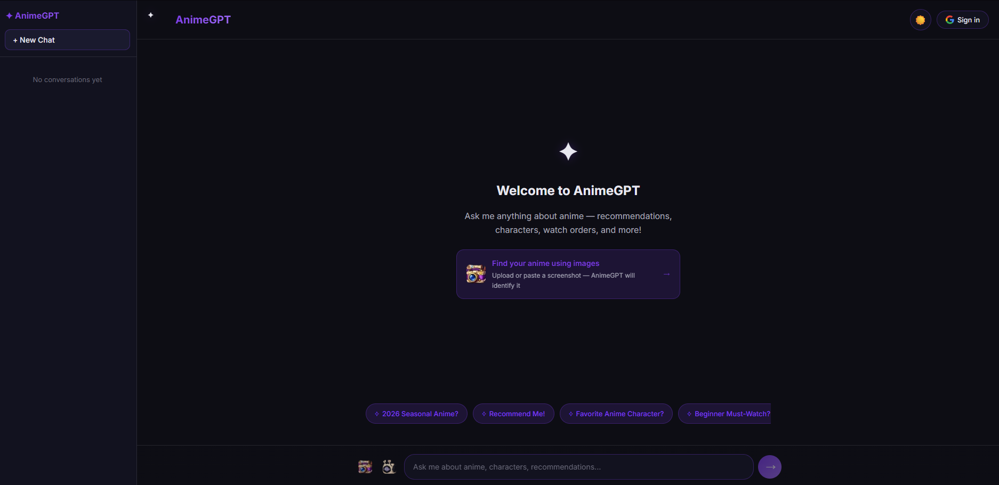
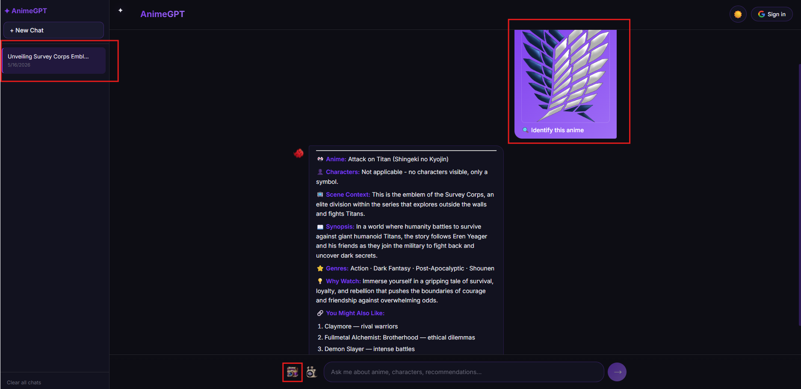
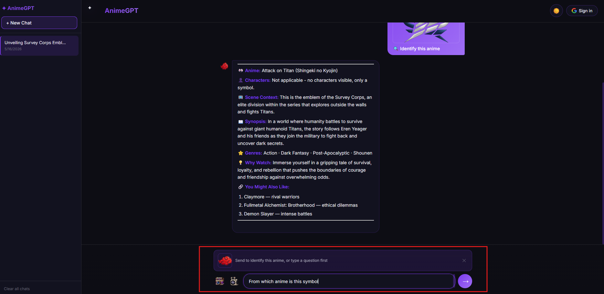
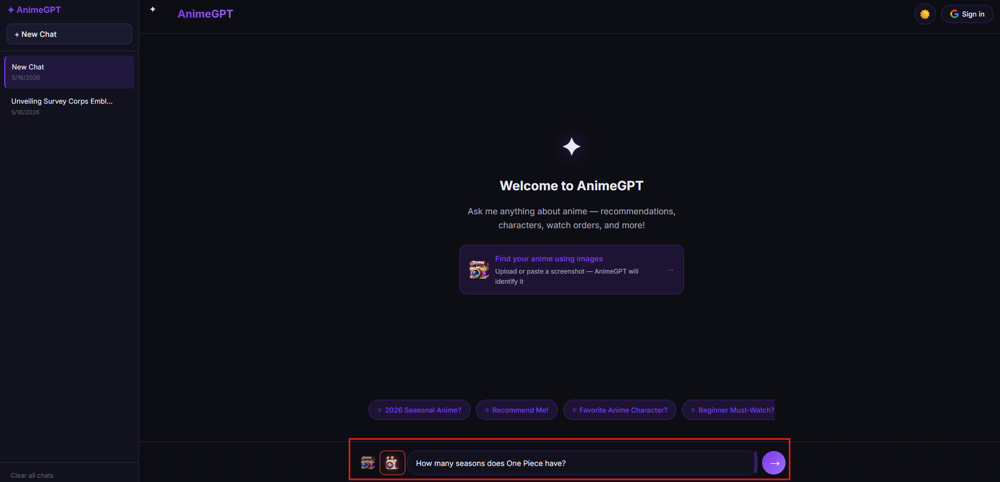
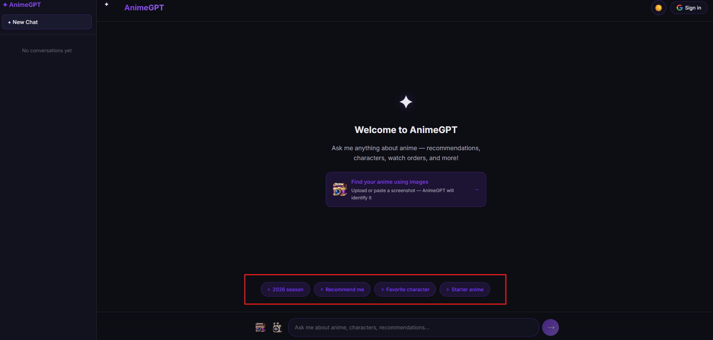
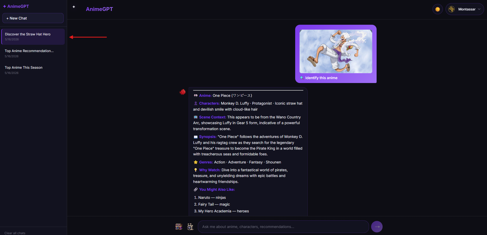
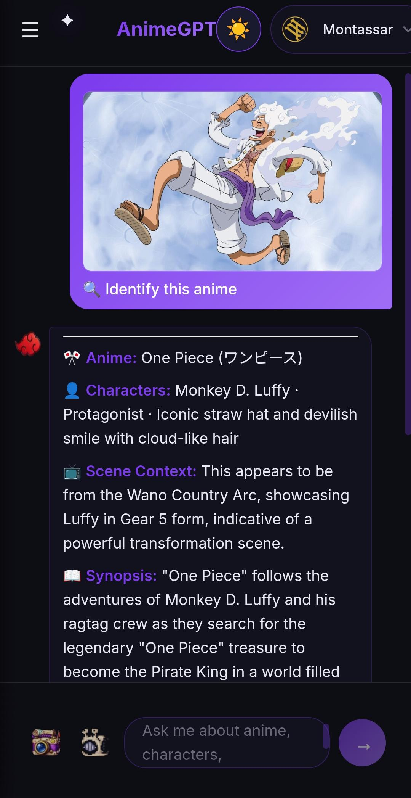
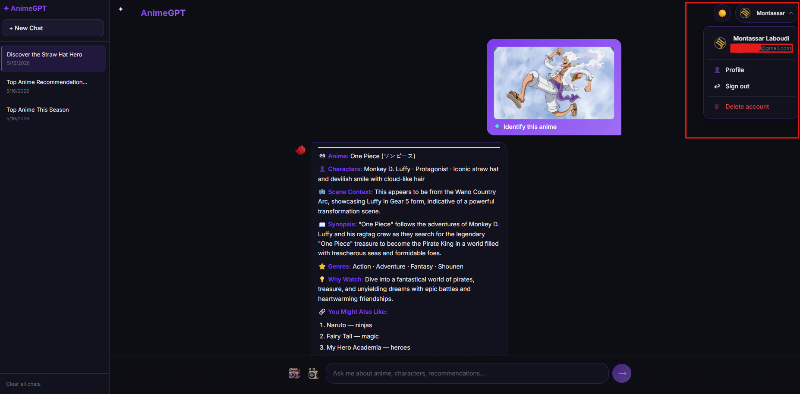
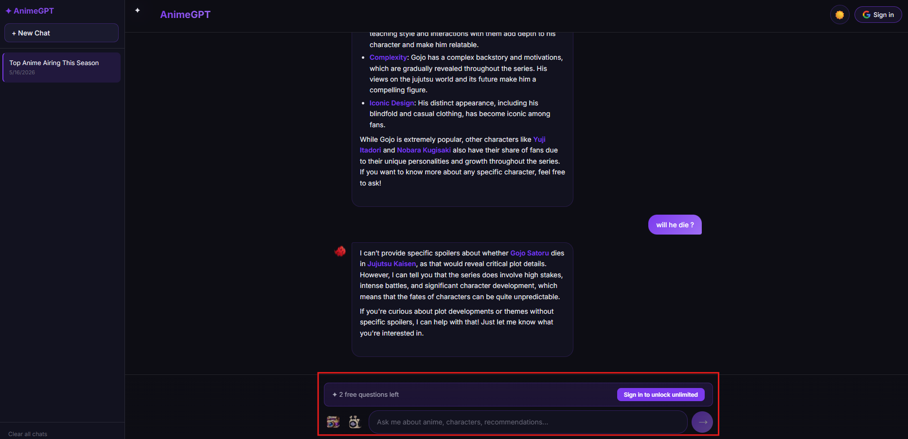
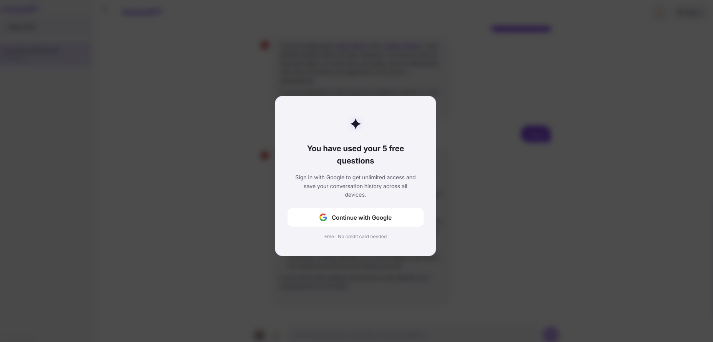

# AnimeGPT

AnimeGPT is a full-stack AI anime assistant built with Next.js, OpenAI, Astra DB, and Vercel Blob.

It combines Retrieval-Augmented Generation (RAG), GPT-4o vision, voice transcription, real-time streaming, and persistent chat history into a polished anime-focused experience.

Users can:
- Ask anime-related questions
- Identify anime from screenshots
- Use voice input with Whisper
- Save conversations across devices
- Upload or paste images directly into chat
- Continue conversations with contextual memory

---

## Live Demo

🚀 https://animegpt-rag-chatbot.vercel.app

---

# Preview

<div align="center">

<table width="100%">

<tr>
<td width="50%" align="center">

<br />
<em>RAG-powered anime conversations with streamed GPT-4o-mini responses.</em>
</td>

<td width="50%" align="center">

<br />
<em>GPT-4o vision identifies anime scenes, characters, and context from screenshots.</em>
</td>
</tr>

<tr>
<td width="50%" align="center">

<br />
<em>Upload or paste anime screenshots directly into the chat input.</em>
</td>

<td width="50%" align="center">

<br />
<em>Voice input powered by OpenAI Whisper transcription.</em>
</td>
</tr>

<tr>
<td width="50%" align="center">

<br />
<em>Astra DB vector search retrieves anime context before response generation.</em>
</td>

<td width="50%" align="center">

<br />
<em>Persistent conversation history with cloud and local storage support.</em>
</td>
</tr>

<tr>
<td width="50%" align="center">

<br />
<em>Responsive mobile-first experience optimized for phones and tablets.</em>
</td>

<td width="50%" align="center">

<br />
<em>Google OAuth authentication with customizable user profiles.</em>
</td>
</tr>

<tr>
<td width="50%" align="center">

<br />
<em>Freemium access model with guest usage limits and upgrade flow.</em>
</td>

<td width="50%" align="center">

<br />
<em>Dynamic prompt suggestions with persistent light and dark themes.</em>
</td>
</tr>

</table>

</div>

---

# Features

## AI Chat

- Retrieval-Augmented Generation (RAG) with Astra DB vector search
- OpenAI embeddings using `text-embedding-3-small`
- GPT-4o-mini streamed responses
- Context-aware anime recommendations
- Markdown-rendered assistant replies
- Auto-generated conversation titles
- Copy-to-clipboard support

---

## Anime Vision Recognition

- GPT-4o-powered anime screenshot identification
- Structured anime scene analysis
- Character and scene recognition
- Upload images directly from device
- Paste images using `Ctrl + V`

---

## Voice Input

- OpenAI Whisper speech-to-text transcription
- Den Den Mushi-inspired recording interface
- Real-time transcript insertion into chat input

---

## Authentication & Persistence

- Google OAuth authentication with NextAuth v5
- Persistent conversation history
- Local guest-mode storage
- Automatic local-to-cloud conversation migration
- Private image storage using Vercel Blob

---

## User Experience

- Streaming typing indicators
- Auto-growing textarea
- Enter-to-send support
- Responsive mobile layout
- Sidebar conversation management
- Dark/light mode persistence
- Profile customization

---

## Freemium System

- 5 free guest questions
- Usage tracking with localStorage
- Sign-in upgrade modal after limit reached

---

# Tech Stack

| Technology | Purpose |
|---|---|
| Next.js App Router | Full-stack React framework |
| React 19 | Frontend UI |
| TypeScript | Type safety |
| OpenAI API | Chat, embeddings, vision, transcription |
| Astra DB | Vector database |
| Vercel Blob | Private image storage |
| NextAuth v5 | Authentication |
| Vercel AI SDK | Streaming responses |
| React Markdown | Markdown rendering |
| Tailwind CSS | Styling |
| Sharp | Image optimization |

---

# Architecture

## Text Chat Flow

```txt
User Question
      ↓
OpenAI Embeddings
      ↓
Astra DB Vector Search
      ↓
Relevant Anime Context
      ↓
GPT-4o-mini Response
      ↓
Real-Time Streaming UI
```

---

## Vision Flow

```txt
Image Upload / Paste
          ↓
Base64 Encoding
          ↓
GPT-4o Vision Analysis
          ↓
Anime + Character Identification
          ↓
Structured Streamed Response
```

---

# Data Flow & Persistence

AnimeGPT uses a hybrid persistence system that supports both guest users and authenticated users.

---

## Guest Mode

When a user is not signed in:

- Conversations are stored locally using `localStorage`
- Messages, titles, and timestamps remain client-side
- No database writes occur
- Users can immediately use the app without authentication

```txt
Guest User
     ↓
Send Message
     ↓
Conversation stored in localStorage
     ↓
Messages persist across refreshes
```

---

## Guest Image Handling

For guest users:

- Uploaded images remain temporary base64 previews
- Images are not uploaded to cloud storage
- Images exist only during the current session

```txt
Guest uploads image
        ↓
Image converted to base64
        ↓
Preview rendered in chat
        ↓
No cloud upload performed
```

---

## Authentication & Migration Flow

When the user signs in with Google OAuth:

1. Guest conversations are read from `localStorage`
2. Conversations are migrated to Astra DB
3. Local guest storage is cleared
4. Future conversations become cloud-persistent automatically

```txt
User signs in
      ↓
Read guest conversations from localStorage
      ↓
Upload conversations to Astra DB
      ↓
Clear local guest storage
      ↓
Switch to authenticated persistence mode
```

This allows users to start instantly as guests and keep their history permanently after authentication.

---

## Authenticated Persistence

For signed-in users:

- Conversations are stored in Astra DB
- Each document contains:
  - userId
  - messages
  - title
  - updatedAt
- All database queries are filtered by the authenticated session

```txt
Authenticated User
        ↓
Send Message
        ↓
Conversation saved in Astra DB
        ↓
History synced across devices
```

---

## Image Storage Flow

Images are handled separately from text conversations.

Instead of storing images directly inside Astra DB documents:

- Images are uploaded to Vercel Blob
- Astra DB stores only the image URL reference

This keeps conversations lightweight and scalable.

---

## Authenticated Image Upload Flow

```txt
User uploads image
        ↓
Image sent to /api/upload-image
        ↓
Uploaded to Vercel Blob Storage
        ↓
Private blob URL returned
        ↓
URL saved inside Astra DB message
```

---

## Secure Image Delivery

Images are uploaded using:

```txt
access: "private"
```

Meaning:
- Direct public access is blocked
- Images are fetched only through authenticated API routes

```txt
Frontend requests /api/blob-image?url=...
                    ↓
API validates session
                    ↓
Server fetches private blob
                    ↓
Image streamed securely to browser
```

---

## Conversation Deletion Flow

When a conversation is deleted:

1. Associated image URLs are collected
2. Blob images are deleted
3. Astra DB conversation document is removed

```txt
Delete Conversation
        ↓
Collect image URLs
        ↓
Delete images from Vercel Blob
        ↓
Delete Astra DB document
```

This prevents orphaned files and unnecessary storage usage.

---

## Persistence Architecture Summary

| Data Type | Guest Users | Authenticated Users |
|---|---|---|
| Messages | localStorage | Astra DB |
| Conversation Titles | localStorage | Astra DB |
| Images | Temporary base64 only | Vercel Blob |
| Image References | Not persisted | Stored in Astra DB |
| Cross-device Sync | No | Yes |
| Persistence After Logout | Local only | Cloud persistent |

---

# Project Structure

```txt
app/
├── api/
│   ├── chat/                  # RAG + vision endpoints
│   ├── transcribe/            # Whisper transcription
│   ├── upload-image/          # Vercel Blob uploads
│   ├── blob-image/            # Private image proxy
│   ├── conversations/         # Conversation CRUD
│   ├── generate-title/        # AI title generation
│   └── suggestions/           # Prompt suggestions

├── components/
│   ├── Bubble.tsx
│   ├── Sidebar.tsx
│   ├── UserMenu.tsx
│   └── ProfileModal.tsx

lib/
├── useConversations.ts
├── useUsageCounter.ts
└── useProfile.ts

scripts/
└── loadDb.ts
```

---

# Environment Variables

```env
OPENAI_API_KEY=

ASTRA_DB_APPLICATION_TOKEN=
ASTRA_DB_API_ENDPOINT=
ASTRA_DB_NAMESPACE=
ASTRA_DB_COLLECTION=

AUTH_SECRET=
AUTH_GOOGLE_ID=
AUTH_GOOGLE_SECRET=

BLOB_READ_WRITE_TOKEN=
```

---

# Getting Started

## Clone the repository

```bash
git clone https://github.com/montassar-laboudi/animegpt-rag-chatbot.git
cd animegpt-rag-chatbot
```

---

## Install dependencies

```bash
npm install
```

---

## Seed the vector database

```bash
npm run seed
```

---

## Start the development server

```bash
npm run dev
```

---

# Data Sources

AnimeGPT builds its RAG knowledge base using anime-focused sources including:

- Anime News Network
- MyAnimeList
- AniList
- Crunchyroll News
- Anime Planet
- LiveChart
- AnimeFillerList
- Behind The Voice Actors

---

# Performance Highlights

- Real-time streamed AI responses
- Hybrid guest/cloud persistence model
- Authenticated private image delivery
- Cached AI prompt suggestions
- Optimized mobile interaction flow
- Blob cleanup during conversation deletion

---

# Future Improvements

- Personalized anime recommendations
- Anime watchlist synchronization
- Multi-image comparison
- Anime timeline search

---

# License

MIT License © 2026 Montassar Laboudi